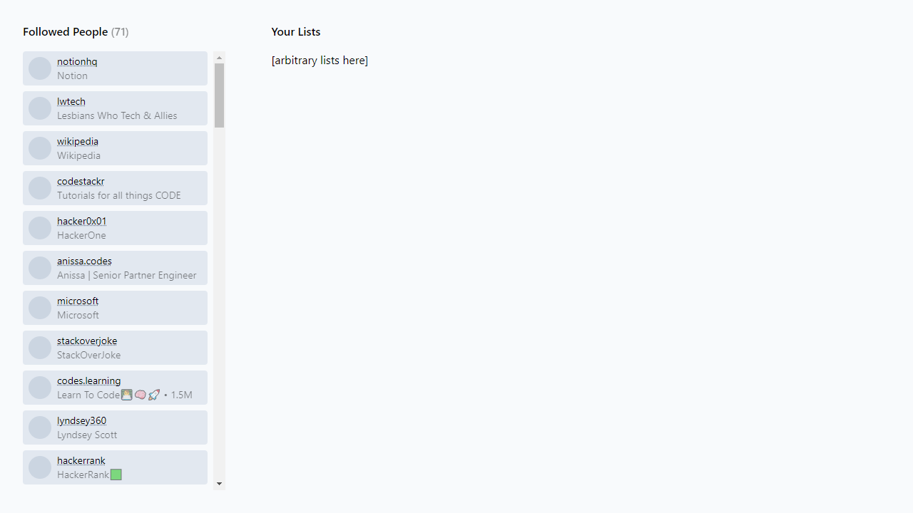

# Instagram Following Lists

This repo is an attempt to organize the "following" on Instagram.

## Rationale/Problem

When a list grows, it becomes unmanagable. To make it managable, the list needs to be broken down into sub-lists.

While I haven't really used it, the Lists on Twitter is an example of this.

This tool should provide some mental comfort to the user by allowing the user know (more) about his/her following.

## UI

NOTE: The [thestackoverflow](https://www.instagram.com/thestackoverflow) IG account is used for the demo.

